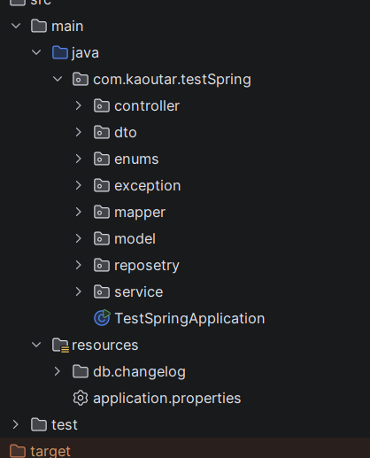
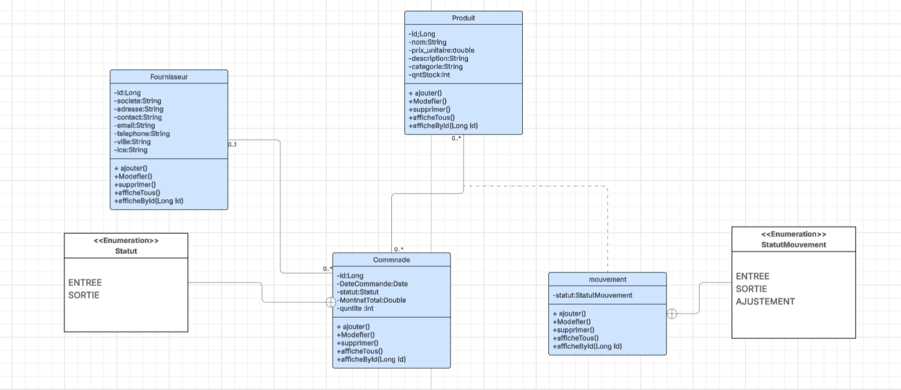
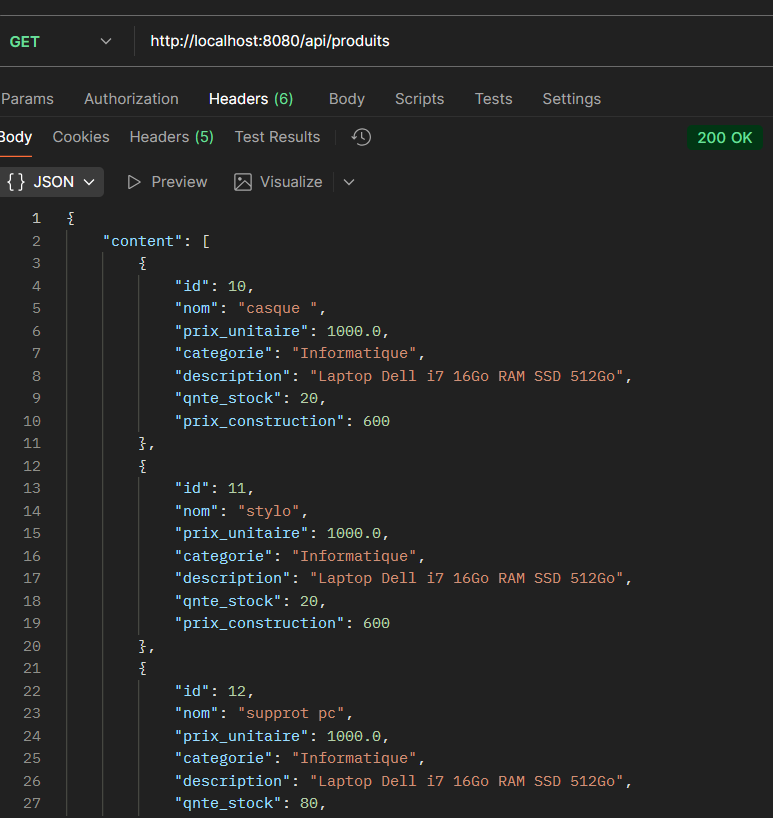
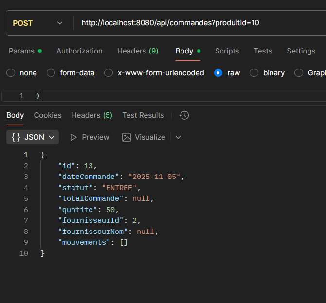

# 🧾 Tricol - Module de Gestion des Commandes Fournisseurs

## 📘 Contexte du projet
L’entreprise **Tricol**, spécialisée dans la conception et la fabrication de vêtements professionnels, poursuit la **digitalisation de ses processus internes**.

Après la mise en place du module de gestion des fournisseurs, un nouveau module a été développé pour la **gestion complète des commandes fournisseurs**, permettant un suivi rigoureux des approvisionnements, du stock et de la valorisation des coûts.

---

## 🎯 Objectifs du projet
- Développer une **API REST** complète avec **Spring Boot**.
- Gérer l’ensemble du **cycle de vie des commandes fournisseurs** : création, suivi, validation, annulation.
- Assurer la **mise à jour automatique du stock** et le **calcul du coût réel** selon les méthodes **FIFO** ou **CUMP**.
- Mettre en place un système **documenté et maintenable**, respectant les bonnes pratiques de l’architecture Spring Boot.

---

## ⚙️ Stack technique
| Technologie | Rôle |
|--------------|------|
| **Spring Boot** | Framework principal pour le backend |
| **Spring Data JPA** | Accès et gestion des données |
| **MapStruct** | Mapping Entity ↔ DTO |
| **Liquibase** | Gestion des migrations de la base de données |
| **Swagger / OpenAPI** | Documentation de l’API |
| **Jakarta Validation** | Validation des données d’entrée |
| **H2 / PostgreSQL** | Base de données |
| **Maven** | Gestion des dépendances |

---

## 🧩 Architecture du projet

L’application suit une **architecture en couches** claire :


---

## 📊 Modèle UML

### Diagramme de classes



---

## 📦 Fonctionnalités principales

### 🧾 Gestion des fournisseurs
- Ajouter / Modifier / Supprimer / Consulter
- Informations : société, contact, adresse, email, téléphone, ICE.

### 📦 Gestion des produits
- Création et suivi des produits.
- Association des produits aux commandes.

### 🛒 Gestion des commandes fournisseurs
- Création, modification, annulation et suivi.
- Statuts : `EN_ATTENTE`, `VALIDÉE`, `LIVRÉE`, `ANNULÉE`.
- Calcul automatique du montant total.

### 🔄 Mouvements et valorisation du stock
- Création automatique des mouvements à la réception d’une commande.
- Mise à jour du stock en temps réel.
- Méthodes de valorisation configurables : **FIFO / CUMP**.

### 🔍 Pagination et filtrage
- Implémentation native de `Pageable` (Spring Data JPA).
- Tri, recherche et navigation par page.

---

## 🧪 Tests des Endpoints

### Documentation Swagger
Lien : [http://localhost:8080/swagger-ui.html](http://localhost:8080/swagger-ui.html)

### Exemples de tests Postman
#### ✅ Test : création d’un fournisseur


#### ✅ Test : affichage des produits avec pagination


#### ✅ Test : création d’une commande fournisseur


#### ✅ Test : mouvement de stock automatique


---

## 📅 Planification du projet (Jira)

Lien vers le tableau de planification Jira :  
👉 [https://kaoutarlaajil.atlassian.net/jira/software/projects/TRIC/list?jql=project+%3D+%22TRIC%22+ORDER+BY+created+DESC&atlOrigin=eyJpIjoiYzUxYTI3MTA3YzI5NDJmZmE5YzVkMmU2YTU0ZDNmZTAiLCJwIjoiaiJ9)

Exemple de tâches Jira :
- `TRICOL-1` : Création de l'entité Fournisseur
- `TRICOL-2` : Implémentation des endpoints REST
- `TRICOL-3` : Gestion des mouvements de stock
- `TRICOL-4` : Intégration Swagger & tests Postman

---

## 🚀 Lancement du projet

### 1️⃣ Cloner le projet
```bash

git clone https://github.com/kooutar/TricoleWithSpringBoot.git
cd TricoleWithSpringBoot
```


